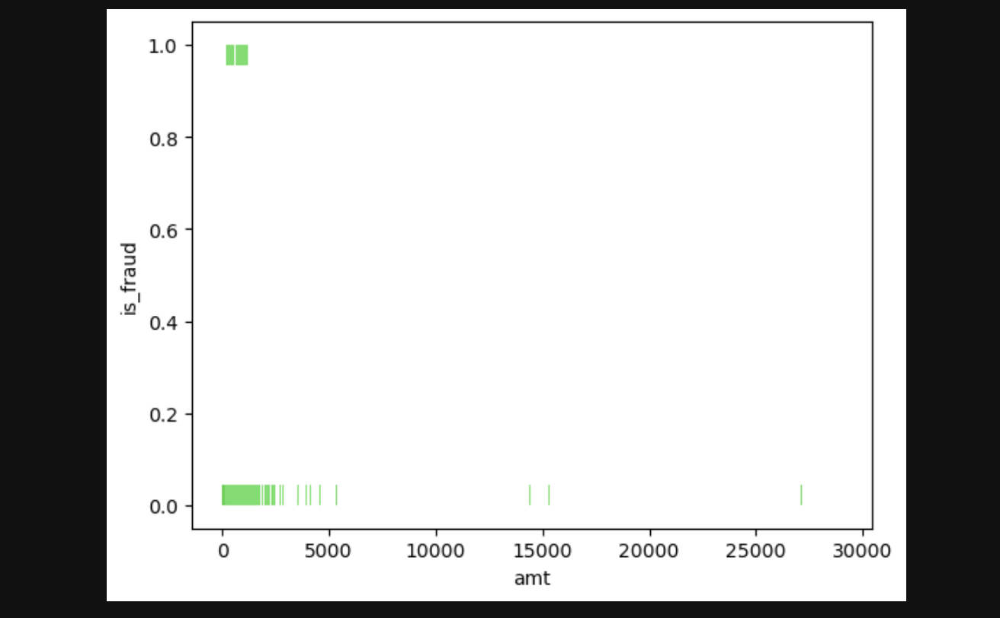
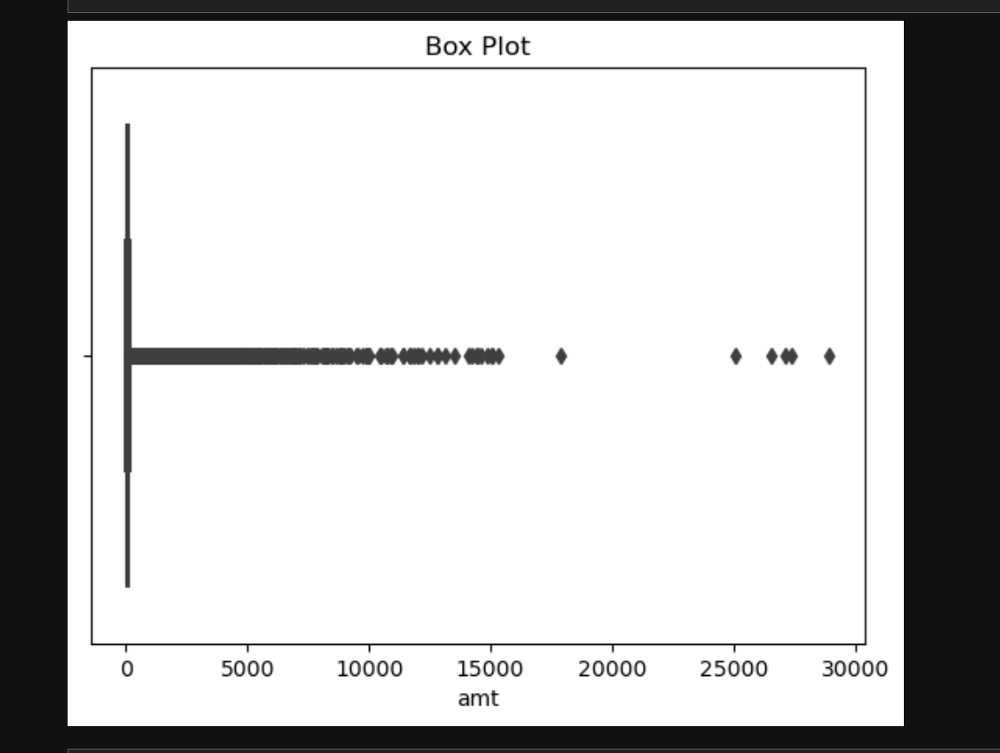
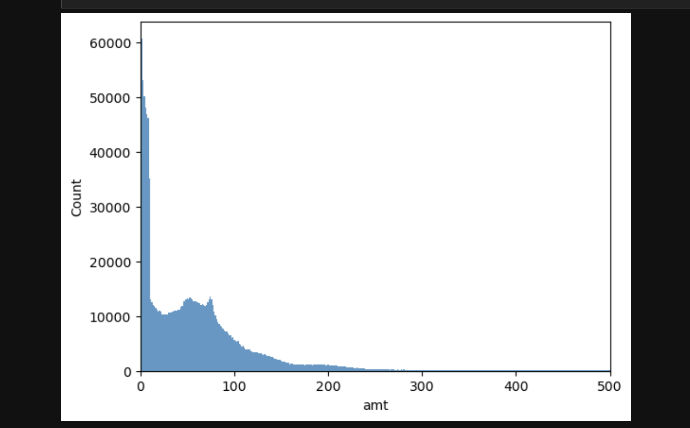
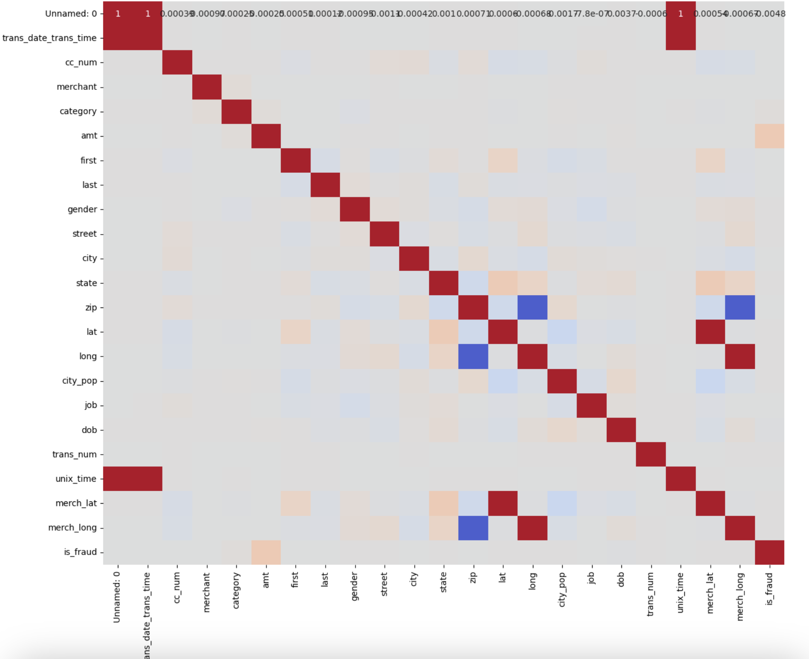
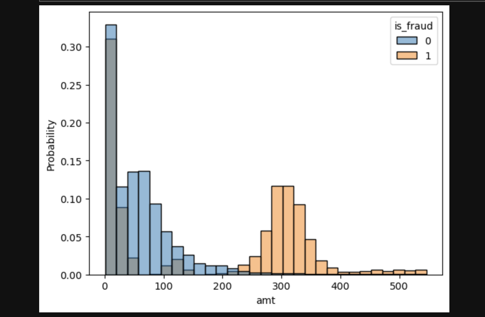
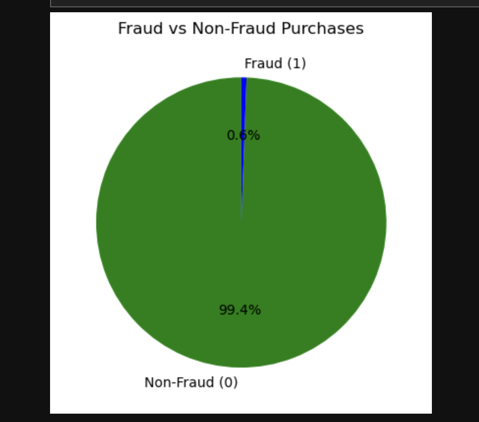
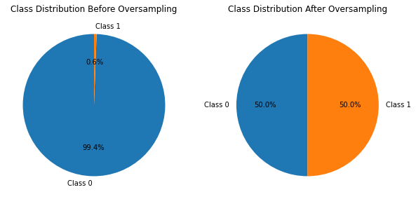

# Project Assignments 

* [Project Proposal](https://canvas.txstate.edu/courses/2179554/assignments/31569710) 
* [Project Progress](https://canvas.txstate.edu/courses/2179554/assignments/31569830)
* [Project Submission](https://canvas.txstate.edu/courses/2179554/assignments/31569848)

 **Submission Format** 
 
1. Python code with markdown documentation, images saved in .jpg or .png format, and README.md as a project report OR
2. Jupyter notebook (.ipynb) that contains full markdown sections as listed above 

# SUBMISSION FORMAT FOR THE REPORTS

#  Detecting Credit Card Fraud
**Jarrett Fontenot, Paige Ephlin, and Abdullah Kamal** 

## Project Summary

We aim to develop a classification model capable of determining fraudulent from legitimate purchases by identifying relevant attributes associated with fraudulent credit card transactions.

In this comprehensive study, we tackled the critical task of fraud detection in credit card transactions. Our approach began with the implementation of linear regression as a baseline model, chosen for its simplicity and interpretability. Leveraging feature scaling, we aimed to expedite the convergence speed of optimization algorithms, contributing to more stable training. Recognizing the need for addressing class imbalance, we strategically incorporated oversampling techniques to ensure a balanced dataset. This pivot away from dimensionality reduction allowed for enhanced model interpretability. Subsequent advanced models, including logistic regression and k-Nearest Neighbors, demonstrated notable improvements over the baseline, achieving high precision, recall, and F1 scores. Visualization through precision-recall curves and confusion matrices provided a clear comparison of model performances. In-depth error analysis shed light on model weaknesses, guiding future enhancements. Our work underscores the importance of an iterative and strategic approach to building an effective fraud detection system.

## Problem Statement 

This project is dedicated to addressing the critical challenge of detecting and preventing fraudulent credit card transactions. With a dataset comprising approximately 2 million entries, the project employs methods such as linear regression and KNN classification to effectively combat fraud. Linear regression is chosen as the benchmark due to its aptness for binary classification tasks, a prevalent feature in fraud detection where outcomes are typically binary (0 or 1). The model's simplicity and interpretability make it an ideal starting point, providing a baseline for evaluating the effectiveness of credit card fraud detection.

The dataset is extensive, containing 1,296,674 rows and 23 columns that detail various aspects of credit card transactions, including transaction date and time, merchant details, and fraud indicators. The dataset encompasses diverse attributes, ranging from customer demographics to transaction amounts and geographic coordinates. Success measures include overall accuracy on cross-validated data, as well as a comprehensive analysis of false positive and false negative rates. The ultimate goal is to construct a robust fraud detection model that not only provides insights into fraud patterns but also demonstrates practical applicability in securing real-world credit card transactions.

The dataset underwent preprocessing, where specific columns, namely "Unnamed: 0," "gender," "state," "zip," "long," "lat," "city_pop," "merch_long," "dob," "street," and "trans_num," were intentionally dropped. This strategic decision, made in the context of oversampling, aimed to balance the dataset by equalizing the number of fraud and non-fraud cases. This process enhances the model's ability to discern fraudulent transactions effectively.

Furthermore, performance metrics for the fraud detection model on the resampled data were evaluated, revealing impressive results:
- Precision: 0.9932
- Recall: 0.9482
- F1 Score: 0.9685

Comparatively, these metrics for the original sample of the dataset were slightly higher:
- Precision: 0.9938
- Recall: 0.9949
- F1 Score: 0.9935

This nuanced comparison showcases the model's ability to maintain high precision and recall even after resampling the data, underscoring its effectiveness in detecting and preventing fraudulent credit card transactions across different datasets.

## Dataset 

Our dataset has 1,296,674 rows (instances) and 23 columns (attributes). These multplied together equals 29,823,502. The data set is very large, and will have enough data to train our model. Our dataset has the rows labeled as: index, trans_date_trans_time,	cc_num,	merchant,	category,	amt,	first,	last,	gender,	street,	city,	state,	zip,	lat,	long,	city_pop,	job,	dob,	trans_num,	unix_time,	merch_lat,	merch_long,	is_fraud.

    index - Unique Identifier for each row
    trans_date_trans_time - Transaction DateTime
    cc_num - Credit Card Number of Customer
    merchant - Merchant Name
    category - Category of Merchant
    amt - Amount of Transaction
    first - First Name of Credit Card Holder
    last - Last Name of Credit Card Holder
    gender - Gender of Credit Card Holder
    street - Street Address of Credit Card Holder
    city - City of Credit Card Holder
    state - State of Credit Card Holder
    zip - Zip of Credit Card Holder
    lat - Latitude Location of Credit Card Holder
    long - Longitude Location of Credit Card Holder
    city_pop - Credit Card Holder's City Population
    job - Job of Credit Card Holder
    dob - Date of Birth of Credit Card Holder
    trans_num - Transaction Number
    unix_time - UNIX Time of transaction
    merch_lat - Latitude Location of Merchant
    merch_long - Longitude Location of Merchant
    is_fraud - Fraud Flag <--- Target Class
    
After over sampling:

    index - Unique Identifier for each row
    trans_date_trans_time - Transaction DateTime
    cc_num - Credit Card Number of Customer
    merchant - Merchant Name
    category - Category of Merchant
    amt - Amount of Transaction
    first - First Name of Credit Card Holder
    last - Last Name of Credit Card Holder
    city - City of Credit Card Holder
    job - Job of Credit Card Holder
    unix_time - UNIX Time of transaction
    merch_lat - Latitude Location of Merchant
    is_fraud - Fraud Flag <--- Target Class

## Exploratory Data Analysis 

Our EDA strategy involves using Heat Maps which helps us identify patterns and dependencies that might not be immediately apparent through other means, Histplots provide They provide insights into the central tendencies, skewness, and spread of data points, aiding in the identification of potential outliers and the overall shape of the data, and Boxplots highlight key statistical measures and identify outliers. Analyzing the shape of the data ensures a foundational understanding of its characteristics, while diving into information and descriptions enhances our comprehension of the dataset's nature. This comprehensive approach guides subsequent analyses and contributes to a more informed and nuanced model-building process.

Before diving into modeling, we conducted EDA to understand the distribution of key features and identify potential patterns or outliers. We then created new features like credit card number frequency and the age of the person at the time of transaction. This was done hoping to improve our models predicting power. The algorithms explored were Logistic Regression and KNN Classification. We chose Logistic Regression because of the binary target column. We chose KNN for an instance based model to see if is more succesful than our Logistic Regression model. The normalization method we used was Standard Scaler, StandardScaler applies Z-score standardization, transforming the features to have a mean of 0 and a standard deviation of 1.

## Data Preprocessing 

We are actively considering the incorporation of both scaling and dimensionality reduction. Recognizing the potential benefits, we acknowledge that scaling could significantly enhance the convergence speed of gradient descent optimization algorithms, leading to quicker training times and more stable convergence by maintaining consistent feature scales. Similarly, we are contemplating the utilization of dimensionality reduction to facilitate data visualization in lower-dimensional spaces, addressing the challenge of interpreting high-dimensional data for a more accessible exploration. However, at this stage, we haven't implemented dimensionality reduction. We have scaled the data using standard scaling.

In our strategic approach to refining our fraud detection model, we made a decisive pivot away from implementing dimensionality reduction and, instead, opted for oversampling techniques. Acknowledging the benefits of oversampling in addressing class imbalance, we have prioritized the generation of synthetic instances to achieve a balanced dataset. This shift allows us to enhance the model's ability to discern between genuine and fraudulent credit card transactions by ensuring a more equitable representation of both classes. While dimensionality reduction was initially considered, our current focus on oversampling aligns with our goal of building a robust and effective fraud detection system. Below is a visualization of the changes we made to our dataset. The blue represents instances of non-fraudulant credit card transactions, and the orange represents fraudulant activity.

## Machine Learning Approaches

In addressing the rarity of fraud instances mentioned and shown prior, we implemented oversampling on instances of fraud to achieve a balanced dataset. We applied the Standard Scaler to normalize the features, ensuring a mean of 0 and a standard deviation of 1. This normalization is crucial for models like K-Nearest Neighbors (KNN) that are sensitive to feature scales. The dataset underwent partitioning into training and testing sets utilizing the train_test_split method to evaluate model performance on unseen data. To bolster the reliability of our model evaluation, we incorporated k-fold cross-validation, assessing performance across various data subsets.

As our baseline model, logistic regression was chosen due to its simplicity, interpretability, and efficiency in binary classification tasks. We utilized k-fold cross-validation to assess its performance across diverse data subsets. Logistic Regression, a member of the linear model family, was mainly chosen for its interpretability and computational efficiency, offering insights into feature impacts on fraud likelihood. 

Following the baseline, we explored KNN, an instance-based learning algorithm. Given the scaled nature of the dataset, KNN was expected to excel, leveraging distance metrics with equal feature contributions. To solve the imbalanced data issue, we applied oversampling exclusively on fraud instances, generating synthetic instances to balance class distribution. This technique aimed to enhance the model's ability to detect fraudulent transactions. KNN, with its capacity to capture non-linear relationships and instance-based learning, was well-suited for detecting local patterns in the feature space following this.

The baseline logistic regression provided a foundational understanding but lacked nuanced pattern recognition. KNN, a more complex ML model, somewhat improved our performance. However, addressing data imbalance through oversampling further elevated the model's fraud detection capabilities. We believe improved data or an increase in the subcategories might further increase the viability of our model.

### Conclusion

The selection of logistic regression as a baseline, followed by exploration of KNN and oversampling, facilitated systematic improvement in the credit card fraud detection model. This iterative approach, incorporating scaling, oversampling, and cross-validation, underscored the significance of mitigating data imbalance for enhanced model performance in fraud detection.

## Experiments 

We have completed a linear regression model, and a KNN classification model. The accuracy scored high, but there is serious imblance in our dataset. We need to explore new ways to create parameters that can better test the dataset, and bring the recall down.

To evaluate our fraud detection solution, we implemented evaluation metrics, including precision, recall, and F1 score. These metrics are crucial in the context of fraud detection, where a balance between correctly identifying fraud (precision) and capturing all instances of fraud (recall) is essential.
The baseline model achieved a recall of approximately 0.95, a precision of 0.99, and an F1 score of 0.99. When using k-Nearest Neighbors with k=1, the training score reached a perfect 1.0, demonstrating excellent fit to the training data. The test score also yielded a high accuracy of 0.995. Precision, recall, and F1 score for the KNN model were notably high, with precision at 0.99, recall at 0.99, and F1 score at 0.99. This indicates a strong overall performance, emphasizing the model's ability to accurately identify and classify instances of fraud, particularly evident in its high recall and precision scores.
Error analysis was conducted to understand the types of misclassifications made by the model. This involved examining false positives and false negatives and identifying patterns or trends that could guide future improvements. Suggestions for enhancement might include feature engineering, tuning model hyperparameters, or exploring more sophisticated algorithms.

## Conclusion

Initially relying solely on logistic regression did not capture the intricate patterns within the data, resulting in limited fraud detection performance. Logistic regression assumes a linear relationship between features and the log-odds of the target class, and it might struggle with the non-linear complexities inherent in fraud detection. Following this, we employed KNN. While KNN showed promise, applying it without addressing the class imbalance did not yield a significant improvement. KNN's effectiveness relies on the proximity of data points. Without addressing the imbalance, the model leaned heavily towards the majority class of non-fraud, neglecting the minority class (fraud instances) and producing an unusually high score. Basic features such as transaction amount and timestamp contributed significantly, but more intricate features related to merchant information did not show substantial improvement and were neglected. Further research would need to be done to find appropriate variables that would improve our model. The limited impact of merchant-related features could be attributed to the complexity of fraudulent activities, which might not be so black and white and may not fully capture standard transaction features. While we explored KNN, we did not extensively tune its hyperparameters. Due to time constraints, a thorough exploration of KNN's hyperparameters was not conducted which may have limited the model's ability to reach its optimal configuration. Our primary evaluation metric was accuracy, which might not be sufficient for imbalanced datasets but proved to be more reliable following our oversampling of the data. In a highly imbalanced context like credit card fraud detection, accuracy alone may not be a reliable indicator of model performance. Focusing on accuracy might mask the model's inability to effectively detect fraud instances. and so we ensured to compose all metrics, including recall and precision.

Our decisions were informed by our evaluation metrics, particularly precision, recall, and F1-score, in addition to the aforementioned accuracy. Precision and recall helped us understand the model's ability to identify fraud instances without falsely labeling non-fraudulent transactions. The focus on these metrics was data-driven, ensuring that the model's performance aligned with the requirements of fraud detection, where false positives and false negatives have more severe consequences. With our attempts at both logistic regressiona and KNN, these data-driven decisions guided us toward approaches that eventually led to improved model performance, particularly the incorporation of oversampling to address the class imbalance.

## Team Contributions

### Jarrett Fontenot:

I completed many different types of EDA, including the shape, info, and head of the dataset. As well as dealing with the null values and creating a pie chart that shows the imbalance in our dataset. I created a graph that showed the probability it is a fraud purchase at different amounts, and two hist plots that show something about the amount. I created two new columns for the dataset, used label encoder to deal with the categorical values, used Standard Scaler to to normalize the data, and created a heatmap. I used train test split to split the data into train and test, trained the logistic regression model, and displayed the results on that model using f1 accuracy and recall. I implemented k folds validation as well for the model. For the readme I completed the summary, adding EDA images,wrote the initial problem statement, and the initial explanation of our dataset.

### Paige Ephlin:

In the readme I completed the project summary, the problem  statement, the updated columns we used after the over sampling, the first part of our exploratory data analysis, the data processing, machine learning approaches , and the experiments section. I also completed the Box plot EDA, the confusion matrices which revealed the true positives, true negatives, false positives, and false negatives. I also trained, fit and scored the KNN classification model, and also validated using k-fold cross validation.

### Abdullah Kamal:

To contribute to the project, I primarily worked on the data preprocessing aspects of the project. To do this effectively, I analyzed the issues pertaining to our data, mainly the imbalance between the fraud/non-fraud data instances. After researching the different methods to solve this problem, I was able to determine oversampling to be the most beneficial method to resolve this data imbalance. Following the oversampling, I generated the necessary plots to visualize the data changes and their desired effects on the model. Using the data, I redefined the primary x and y variables as x_resampled and y_resampled and reran our logistic regression and knn models, seeing a noticeable increase in model score, accuracy, etc. Aside from my contributions to the project notebook, I cowrote the dataset and problem statement sections. I researched and wrote up the machine learning approach section, describing the key reasons for using our chosen machine learning models. I then collected and presented our findings, desired future work, and limitations in the conclusion. 

